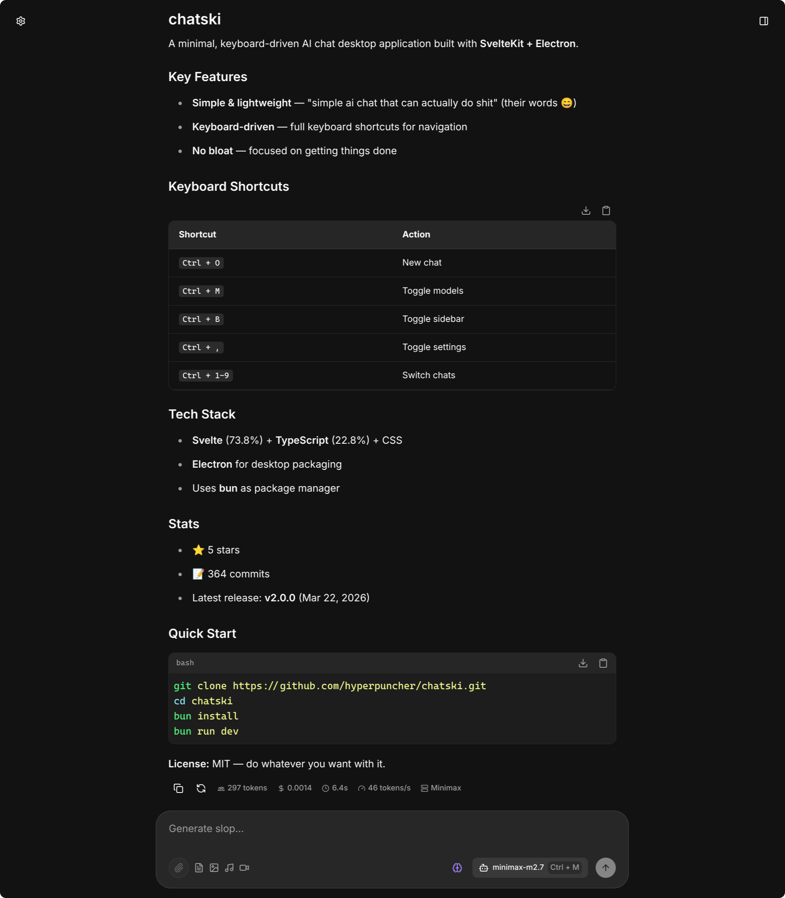

<div align="center">
	<h1>🤖 chatski</h1>
    <p>minimal self-hosted ai chat interface for openrouter</p>
	<picture>
		<source
			srcset=".github/assets/screenshot-dark.png"
			media="(prefers-color-scheme: dark)"
		>
		<source
			srcset=".github/assets/screenshot-light.png"
			media="(prefers-color-scheme: light)"
		>
		
	</picture>
</div>

## tldr

- **sveltekit** + **bun**
- **self-hosted**
- **keyboard driven**
- **no bloat**

## self-host

just throw `compose.yaml` at your preferred deployment platform and fill in the env

## shortcuts

- `ctrl` + `o` - new chat
- `ctrl` + `m` - toggle models
- `ctrl` + `b` - toggle sidebar
- `ctrl` + `1-9` - switch chats

## local dev

### prerequisites

- bun
- redis

```bash
# clone & install
git clone https://github.com/hyperpuncher/chatski.git
cd chatski
bun install

# copy env and fill it out
cp .env.example .env

# dev
bun run dev

# production
bun run build
bun run start
```

## license

do whatever you want with it
