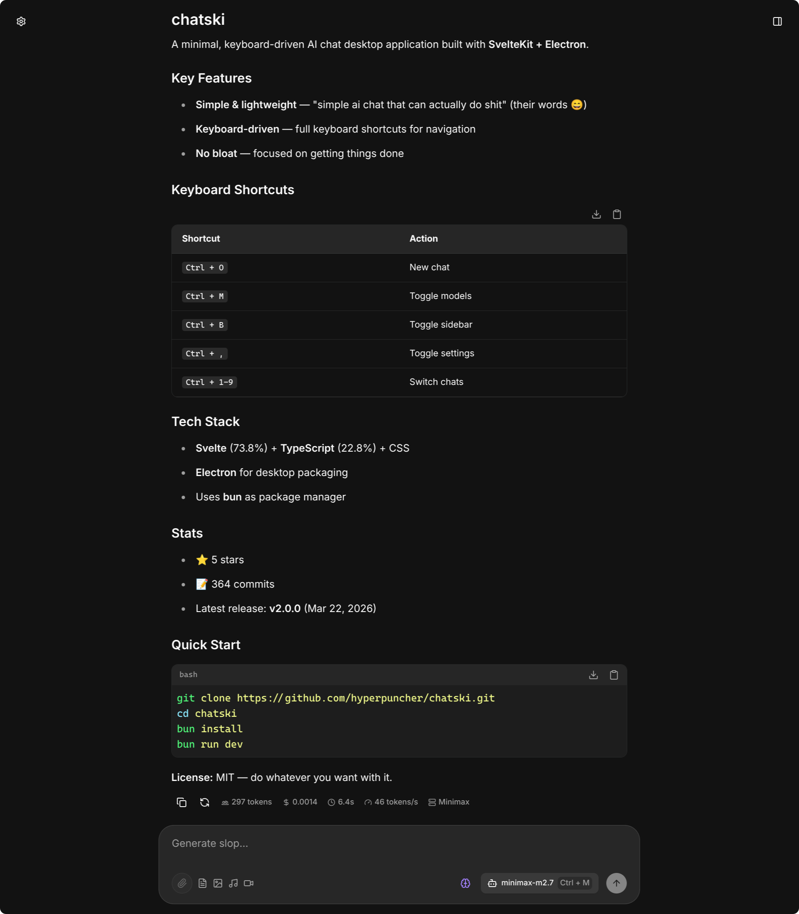

# 🤖 chatski

> simple ai chat that can actually do shit

<div>
	<picture>
		<source
			srcset=".github/assets/screenshot-dark.png"
			media="(prefers-color-scheme: dark)"
		>
		<source
			srcset=".github/assets/screenshot-light.png"
			media="(prefers-color-scheme: light)"
		>
		
	</picture>
</div>

## tldr

- **sveltekit** + **electron**
- **keyboard driven**
- **no bloat**

## download

latest [release](https://github.com/hyperpuncher/chatski/releases/latest)

## shortcuts

| shortcut       | action             |
| -------------- | ------------------ |
| `ctrl` + `o`   | new chat           |
| `ctrl` + `m`   | toggle models      |
| `ctrl` + `t`   | toggle tool output |
| `ctrl` + `r`   | toggle reasoning   |
| `ctrl` + `,`   | toggle settings    |
| `ctrl` + `b`   | toggle sidebar     |
| `ctrl` + `1-9` | switch chats       |

## dev

```bash
git clone https://github.com/hyperpuncher/chatski.git
cd chatski
bun install
bun run dev
```

## build

```bash
bun run build:linux
bun run build:mac
bun run build:windows
```

## license

do whatever you want with it
